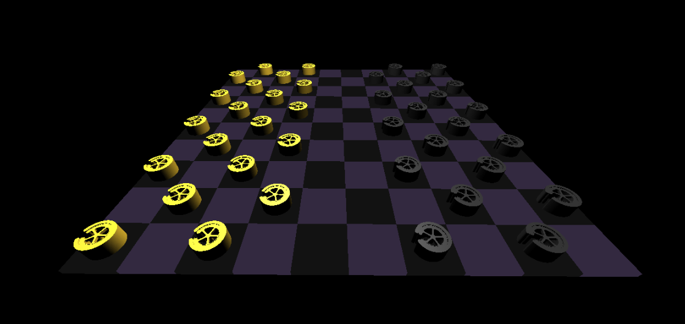

# 3dCheckersGame
Clone this repository to play checkers in 3 dimensions!
This game relies on the THREE.js framework/library which is used to create the 3d Scene, camera, squares, and game pieces.
I modeled the game pieces in OnShape free CAD software and imported them as STL files using the THREE.js loader function

